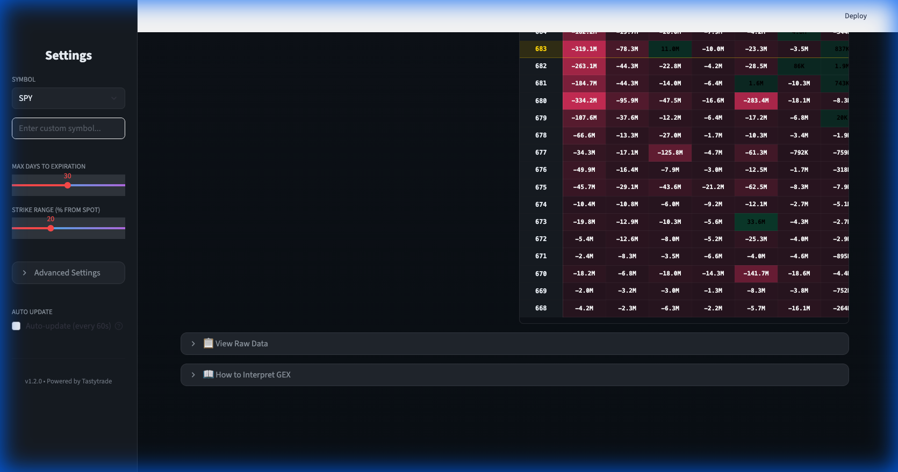

# GEX Tool



A comprehensive Gamma Exposure (GEX) analysis tool for Tastytrade, featuring both a modern **Full-Stack Web Dashboard** and standalone **Analysis Scripts**.

## Features

- **Institutional Dashboard**: High-fidelity dark mode UI using Next.js & Shadcn UI.
- **Real-Time Data**: Streaming market data via dxFeed (dxLink).
- **GEX Profiling**: Calculate Zero Gamma levels, Call/Put Walls, and detailed option flow.
- **Visualizations**: Interactive charts for Net GEX, Strike distribution, and Major Levels.
- **Universe Scanner**: Analyze multiple symbols efficiently.

## Architecture

- **Frontend** (`/frontend`): TypeScript / Next.js / Shadcn UI
- **Backend** (`/backend`): Python / FastAPI (Handles connection, streaming, and calculations)
- **Scripts** (`/`): Standalone Python scripts for quick analysis and probing.

## Prerequisites

- **Python 3.10+**
- **Node.js 18+** (for the Web Dashboard)
- **Tastytrade Account** (with API access)

## Installation

1.  **Clone the repository:**
    ```bash
    git clone <repository-url>
    cd gex-tool
    ```

2.  **Set up Python Environment:**
    ```bash
    python -m venv .venv
    source .venv/bin/activate  # Windows: .venv\Scripts\activate
    pip install -r requirements.txt
    ```

3.  **Set up Frontend:**
    ```bash
    cd frontend
    npm install
    cd ..
    ```

4.  **Configuration:**
    Copy `.env.example` to `.env` and add your credentials:
    ```bash
    cp .env.example .env
    ```
    Edit `.env`:
    ```env
    TT_CLIENT_SECRET=your_client_secret_here
    TT_REFRESH_TOKEN=your_refresh_token_here
    ```

## Usage

### 🚀 Full Stack Web App (Recommended)

The easiest way to run the full experience is using the helper script. This launches both the FastAPI backend and Next.js frontend.

```bash
./start_app.sh
```

- **Frontend**: http://localhost:3000
- **Backend API**: http://localhost:8000/docs

### 🐍 Standalone Scripts

You can still use the CLI tools for quick, lightweight analysis.

**Main GEX Calculation (SPY default):**
```bash
python gex.py
```

**Utilities:**
- `python scripts/check_sdk.py` - Verify API connectivity.
- `python scripts/probe_instruments.py` - Look up instrument details.


## Manual Startup

If you prefer to run services individually:

**Backend:**
```bash
source .venv/bin/activate
uvicorn backend.main:app --host 127.0.0.1 --port 8000 --reload
```

**Frontend:**
```bash
cd frontend
npm run dev
```

## Browser Compatibility

The Web Dashboard uses advanced CSS (glassmorphism/backdrop-filter).
- **Supported**: Chrome/Edge 76+, Firefox 103+, Safari 9+
- **Legacy**: Older browsers will see solid backgrounds instead of blur effects.

## Disclaimer

This software is for educational purposes only. Do not use it as the sole basis for investment decisions.
