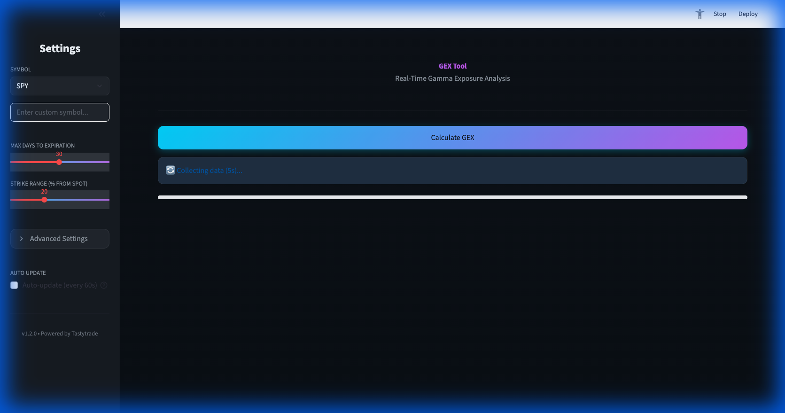
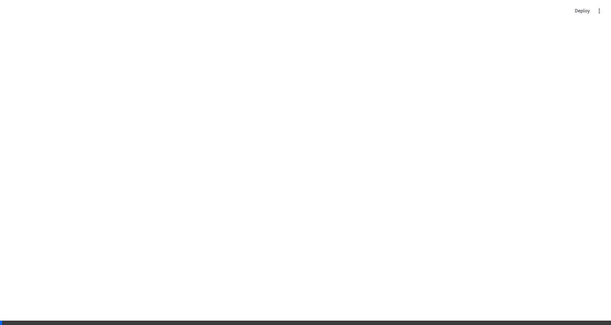

# GEX Tool



A Python-based tool for calculating Gamma Exposure (GEX) using the Tastytrade API and dxFeed.

## Features

### Real-time Auto-Update
The dashboard automatically refreshes data, keeping you in sync with market movements.



## Overview

This project provides scripts to fetch option chain data, calculate GEX profiles (including Zero Gamma levels), and analyze market gamma exposure. It uses dxLink for real-time data streaming.

## Prerequisites

- Python 3.10+ (required by the tastytrade SDK)
- A Tastytrade account (for API access).
- A valid Tastytrade refresh token and client secret.

## Installation

1.  **Clone the repository:**
    ```bash
    git clone <repository-url>
    cd gex-tool
    ```

2.  **Create and activate a virtual environment:**
    ```bash
    python -m venv .venv
    source .venv/bin/activate  # On Windows use: .venv\Scripts\activate
    ```

3.  **Install dependencies:**
    ```bash
    pip install -r requirements.txt
    ```

## Configuration

1.  Copy `.env.example` to `.env`:
    ```bash
    cp .env.example .env
    ```

2.  Edit `.env` and add your Tastytrade credentials:
    ```
    TT_CLIENT_SECRET=your_client_secret_here
    TT_REFRESH_TOKEN=your_refresh_token_here
    ```

## Usage

### Main GEX Calculation
Run the main script to calculate GEX. The script currently defaults to monitoring **SPY** for the next 30 days.

```bash
python gex.py
```

### Utilities

-   **Check SDK/Connection:**
    Use `check_sdk.py` to verify your environment and API connectivity.
    ```bash
    python check_sdk.py
    ```

-   **Probe Instruments:**
    Use `probe_instruments.py` to look up instrument details or symbols.
    ```bash
    python probe_instruments.py
    ```

## Testing / Smoke checks

Use these quick checks to verify your environment before running the Streamlit dashboard or the main calculator:

1. **Confirm Python version** (must be 3.10+):
    ```bash
    python --version
    ```

2. **Validate tastytrade SDK imports** using the provided helper (ensures the required modules are available in your environment):
    ```bash
    python check_sdk.py
    ```

3. **Run the Streamlit app locally** to confirm the dashboard loads:
    ```bash
    streamlit run streamlit_app.py
    ```

If step 1 reports a version lower than 3.10, install a newer Python interpreter and recreate your virtual environment. If step 2 fails, reinstall dependencies with `pip install -r requirements.txt`.

## Browser Compatibility

The GEX Tool dashboard uses modern CSS features for its dark theme and glassmorphism effects. For the best experience, use one of these browsers:

### Fully Supported
- **Chrome/Edge 76+** - Full support for all features including backdrop-filter
- **Firefox 103+** - Full support for all features including backdrop-filter
- **Safari 9+** - Full support with -webkit prefix for backdrop-filter

### Limited Support
- **Older browsers** - Basic functionality will work, but glassmorphism effects will fall back to solid backgrounds
- Browsers without backdrop-filter support will use semi-transparent solid backgrounds instead of blur effects

### Known Issues
- **Internet Explorer** - Not supported (use a modern browser)
- **Firefox < 103** - Glassmorphism effects may not render; enable `layout.css.backdrop-filter.enabled` in `about:config`

### Testing Your Browser
The dashboard will automatically detect your browser capabilities and apply appropriate fallbacks. If you experience visual issues:
1. Ensure your browser is up to date
2. Check that hardware acceleration is enabled in browser settings
3. Try clearing your browser cache

## Disclaimer

This software is for educational purposes only. Do not use it as the sole basis for investment decisions.
